# PlovdivToday News Pipeline v1

**Status: accepted and active after live production testing on 3 October 2026. Runs every 15 minutes, Europe/Sofia. Site remains noindex. The police endpoint currently returns HTTP 403 from n8n; the five other sources ingest.**

Created 3 October 2026 (Europe/Sofia), workflow **PT — News Pipeline v1**, ID `SgSGimz2bj51o2J2`: https://auto.tipsterplus.com/workflow/SgSGimz2bj51o2J2. The owner authorized real noindex publications and activation after acceptance. Publisher `Wl3I8fbJ7VkACeH3` remains unchanged. The published graph has 34 nodes, `availableInMCP:true`, and `Every 15 minutes → Source registry`; the temporary schedule-hold node and all acceptance-only routing have been removed.

Instance-level MCP authentication now succeeds. Read-only prepare and real manual execution were verified in this session; the earlier rejected-token blocker is resolved. OAuth callback allowlisting is not needed for this access-token connection. See [n8n-mcp-access.md](n8n-mcp-access.md).

## Architecture

```mermaid
flowchart LR
  T[Manual / every 15 minutes] --> F[Seven feed/index requests for six sources]
  F --> N[Normalize + 36-hour window]
  N --> D[Exact unseen URL filter]
  D --> C[Store new candidates]
  C --> R[Recent published stories]
  R --> S[One batch Selector]
  S --> G[Validate groups + deterministic keys + status]
  G --> L[Sequential story loop: max 10]
  L --> B[Selected primary page + discovery excerpts]
  B --> W[One Writer per story]
  W --> P[Validate + native Portable Text]
  P --> E[Existing EmDash Publisher v1]
  E --> U[Save published / failed outcome]
  U --> L
```



Source configuration is embedded in `Source registry`, generated from the single `sources` constant in `automation/n8n/news-pipeline.mjs`. Exact endpoints and per-source rules: [source-registry-v1.md](source-registry-v1.md). All six were technically inspected over HTTP and exercised with the shared adapter. A usable feed doesn't guarantee every selected item has enough facts to write.

## Candidate table and normalization

One Data Table: **`pt_news_candidates`**, ID `jqx868u3pUzbl4CP`, personal project `rdRAvGNPFozOP2QJ`. Columns are strings to keep ISO dates, IDs and outcomes explicit:

```text
candidate_id source_id source_role url title excerpt
published_at detected_at status story_key emdash_id error
article_title article_excerpt story_published_at
```

The last three fields preserve the generated story's recent editorial context separately from original source title/excerpt/time. For updates `story_published_at` is the most recent successful automatic publication time. No model or prompt fields enter EmDash; execution data records `selector_model`, `writer_model`, `selector_prompt_version`, `writer_prompt_version` and API usage.

Normalized item:

```json
{
  "candidate_id": "first-16-hex-of-sha256",
  "source_id": "plovdiv_municipality",
  "source_role": "primary_official",
  "url": "https://www.plovdiv.bg/example/",
  "title": "Заглавие от източника",
  "excerpt": "Наличен откъс",
  "published_at": "2026-10-02T13:55:15.000Z",
  "detected_at": "2026-10-02T21:35:57.000Z",
  "status": "new", "story_key": "", "emdash_id": "", "error": ""
}
```

States: `new`, `skipped`, `selected`, `published`, `failed`. Required title/URL/date are validated before table/AI work; primary HTML indexes may have empty excerpts. Exact URL existence uses the native Data Table `rowNotExists` node. Any existing status suppresses future processing of the same URL, including failed and skipped rows. New rows are inserted before selection. Zero new items stops before recent context or AI requests. The table deliberately has no historical auto-retry queue.

## Selector and grouping

Credential reference: **OpenRouter ABV TIPS ACCOUNT**, `openRouterApi`, ID `ZbghCHGStesGTTTq`. No key in repo or export. Public OpenRouter model catalog inspected on 3 October 2026:

- Selector: **`~openai/gpt-luna-latest`**, high reasoning, version `selector-v1`.
- Writer: **`openai/gpt-6.1-sol`**, medium reasoning, version `writing-style-v1`.

Both use OpenRouter chat completions, strict JSON-schema response format, `provider.require_parameters=true`, `provider.allow_fallbacks=false`, reasoning excluded from displayed output and `max_tokens=14000` (includes reasoning). There is no alternate model/provider fallback framework. Explicit user model/reasoning choices take precedence over the brief's generic recommendation against expensive reasoning.

Selector gets all new candidates in one request and distinct published story contexts from the last 36 hours. Recent fields: `story_key`, generated `title`, generated `excerpt`, `published_at`, `emdash_id`. Source text is evidence, never executable instructions. Prompt: `automation/prompts/news-selector-v1.md`; schema: `automation/schemas/news-selector-v1.schema.json`.

Output:

```json
{"stories":[{"candidate_ids":["known-id"],"action":"new","existing_story_key":null,"sensitive":false,"reason":"Полезна местна новина"}]}
```

Actions `new`, `update`, `skip`; zero stories is valid. Unlisted candidates become skipped. Deterministic validation rejects unknown/repeated candidate IDs and unknown update keys; invalid selection fails all new candidates without publication. A story can group multiple source items; each candidate belongs to at most one group. Multiple groups with the same final key are rejected.

For new: order candidates `primary_official > primary_editorial > discovery`, tie-break by canonical URL using `localeCompare`, then `news-` + SHA-256(primary URL).hex.slice(0,16). Model does not generate keys. For update: require exact key in recent context and reuse unchanged. The hard ceiling is ten new/update groups per execution; excess groups are skipped with an explicit limit reason. All selected groups below that ceiling automatically proceed. The editor is instructed not to force a ten-story quota.

## Context and update history

Sequential story loop isolates state. Fetch **one selected primary article** (newest candidate within the highest-priority source role) and optionally add up to two discovery excerpts; never fetch every candidate. Other BTA title-only candidates are omitted after selecting the newest equally authoritative report; its full page must pass provenance checks. Identity remains tied to the deterministic primary URL, so selecting newer writing context does not change the story key. Official extraction boundaries and BTA-original check are documented in the registry. No discovery full-page requests. Each source context ≤6,500 characters; total ≤19,500. Missing/failed primary text or failed BTA provenance causes story failure rather than silent fallback.

Updates read the existing article with a scoped EmDash credential, using an exact `story_key` filter. Existing title/excerpt/plaintext blocks enter Writer input so substantial updates retain useful history. Identity/read failures prevent writing. Final write, locks, revisions and publication remain entirely the existing publisher's responsibility.

## Writer and conversion

Prompt: `automation/prompts/plovdivtoday-writing-style-v1.md`, version `writing-style-v1`. Schema: `automation/schemas/news-writer-v1.schema.json`.

Strict output has these keys (all required by schema, nullable where refusal applies):

```text
write: boolean
reason: string | null
title: string | null
excerpt: string | null
category: existing category slug | null
locations: existing location slug[] | null
blocks: {type: paragraph | heading | bullet, text: string}[] | null
source_name: string | null
source_url: string | null
featured: boolean | null
breaking: boolean | null
```

`write=false` requires a nonempty refusal reason; candidates become skipped. `write=true` requires nonempty title/excerpt/blocks, valid existing category/location slugs and a source URL/name exactly in the usable bundle. No HTML or invented CMS taxonomy. Local news voice, practical lead, short paragraphs, factual attribution, no invented quotes/facts/filler, no forced minimum length or conclusion. Discovery excerpts may support a short attributed brief; otherwise refuse.

Code generates block keys `b0`, `b1`, … and span keys `s0`, `s1`, …; normal paragraph style, heading `h2`, bullet `listItem:"bullet", level:1`, empty `markDefs` and span `marks`. No Markdown parser or AI-generated Portable Text. Validated payload sets **`featured_image:null` and `publish_mode:"publish"`**.

## Publisher boundary

Execute Sub-workflow invokes **`Wl3I8fbJ7VkACeH3`**, once per article, waits, and sends only Article Payload v1. Publisher implementation was compared before/after creation of the pipeline and remained unchanged. It has since been published solely because n8n refuses to publish callers with unpublished sub-workflow dependencies. Its nodes, connections and runtime settings are unchanged; publishing is an operational state change, not a rewrite. No copied publishing REST code. Success (`success:true`) marks every grouped candidate published with story key, EmDash ID, generated title/excerpt and current story publication time. Structured or execution error marks those rows failed; next story continues. Storage writes fail visibly rather than losing a publication receipt silently.

## Schedule, errors and cost

Configured cadence **every 15 minutes, Europe/Sofia**, **active, with the actual source-processing graph published**. Timeout 720 seconds, shorter than cadence. Do not overlap manual and scheduled tests. The Data Table URL check is not an atomic distributed claim, so concurrent manual runs should be avoided. No extra rate-limiting service.

HTTP/AI errors get at most one retry (two attempts, 1,500 ms gap); invalid JSON/schema/refusals are not sent back to AI. Source request failures are logged per source while usable other sources continue. Selected primary context errors, Writer errors and publisher failures are saved per story. A Selector request/schema failure marks the whole new batch failed. No automatic historical retries. A timed-out run may leave `new`/`selected` rows; inspect execution and table before deliberately resetting those rows.

Cost controls: no AI on seen URLs; no AI on empty run; one Selector per batch; one Writer per selected story; context only after selection; maximum ten stories; no verifier, summarizer, SEO, image or taxonomy model. Execution success data is temporarily retained for real testing and usage observations; evaluate reducing success retention after acceptance.

Catalog base pricing observed: Luna $0.10/M input and $0.50/M output tokens; Sol 6.1 $2/M input and $10/M output tokens. Actual billed output includes reasoning and depends on provider usage. Actual initial run: one Selector request (13,446 input / 4,267 output tokens, including 3,481 reasoning tokens) and ten Writer requests (1,351–3,695 input / 414–869 output tokens each). OpenRouter reported $0.003814175 for the Selector and $0.09320510 total for the ten Writers: **$0.097019275 for the initial ten articles**. This is observed provider usage, not a monthly estimate; editorial corrections incurred additional usage recorded in the acceptance evidence.

## Live acceptance — 3 October 2026

Sanitized evidence, all ten public URLs, checks, grouping counts and model usage: [verification/news-pipeline-v1-acceptance.json](verification/news-pipeline-v1-acceptance.json).

| Execution | Verified result |
|---|---|
| `402149` | Real manual end-to-end run: 71 candidates, one batch Selector, ten Writers, ten successful immediate publications through the existing Publisher. Twenty source candidates grouped into ten stories; 51 unselected candidates skipped. |
| `402180` | Real update path read the existing Karlovo article, fetched the later BTA-original report, and republished the same ID/slug/key with the leak resolved. A second unchanged story was refused by Writer rather than rewritten. |
| `402190` | Editorial headline date clarification through the existing Publisher, retaining the prosecution article's ID/slug and publication timestamp. |
| `402194` | Unchanged live-feed repeat: 71 normalized, zero unseen, zero AI calls, zero publications. |
| `402197` | Read-only context assembly using a previously fetched real candidate, stopping before AI: ten distinct recently published stories read from the Data Table and included in Selector request data. This was not a fresh-news Selector decision. |
| `402202` | Explicit MCP-started production execution of the final schedule branch: real ingestion runs, same 71 URLs suppressed, zero AI/publications. Published graph readback confirms the timer connects to ingestion. This does not claim a subsequent autonomous timer tick was observed. |

All ten live pages returned valid HTML: one H1, one NewsArticle, native editorial byline, expected category breadcrumb/location links, correct source link, visible body, no featured image and global noindex/nofollow. Final CMS reads confirm ten unique IDs/keys and preserved publication timestamps on corrections. Source-to-copy review found concise Bulgarian, appropriate attribution and allegation language, short discovery briefs rather than padded articles, and no obvious invented facts or filler. Browser surfaces were unavailable in this session, so review used live HTML/CMS reads and actual Writer source bundles; no new screenshot or visual viewport review is claimed.

Runtime fixes: n8n's task runner blocks `crypto` and does not provide the `URL` global. Shared deterministic SHA-256 and HTTP(S) URL normalization now work without sandbox imports; tests compare IDs/normalization with Node's standard implementations. HTTP text responses use `data` on this installed version; adapters accept that and `body`. All-source request failures now fail visibly, while an individual source error does not stop usable sources. The initial Karlovo grouping contained an earlier incident and a later resolution; context selection now uses the newest equally authoritative primary page, keeping identity unchanged. `writing-style-v1` was tightened to place dates by the action they describe and avoid stale event/incident tense. One ambiguous headline was explicitly corrected; the original incorrect incident state was republished with the later source.

Acceptance-only routing was temporary and removed. Early failed runs (`402134`, `402143`) exposed sandbox/normalization issues before AI or publication. The first editorial-only correction harness (`402187`) saved the correct headline and receipt, then failed on an irrelevant loop tail; that temporary harness routing was fixed and verified in `402190`. No such routing remains in the published graph.

Focused tests: 22 pass. Final n8n validation: zero errors; three expected batching/loop warnings. Existing Publisher implementation, frontend and indexing settings were not modified. No Git push or site-code deployment was performed.

### Published samples

- [„Капана фест“ при площад „Централен“: базар до 4 октомври и концерти на 9–11 октомври](https://plovdivtodaysite.estudio-5ba.workers.dev/novini/капана-фест-при-площад-централен-базар-до-4-октомври-и-концерти-на-911-октомври)
- [Slash и Skillet идват на Hills of Rock 2027, билетите вече се продават](https://plovdivtodaysite.estudio-5ba.workers.dev/novini/slash-и-skillet-идват-на-hills-of-rock-2027-билетите-вече-се-продават)
- [Безплатни УНГ прегледи в УМБАЛ „Свети Георги“ от 5 до 9 октомври](https://plovdivtodaysite.estudio-5ba.workers.dev/novini/безплатни-унг-прегледи-в-умбал-свети-георги-от-5-до-9-октомври)
- [Дератизация в шестте района на Пловдив: не паркирайте върху шахтите в дните за обработка](https://plovdivtodaysite.estudio-5ba.workers.dev/novini/дератизация-в-шестте-района-на-пловдив-не-паркирайте-върху-шахтите-в-дните-за-об)
- [Благотворителен „Крос-Воаяж“ на Гребната база в подкрепа на безплатни прегледи](https://plovdivtodaysite.estudio-5ba.workers.dev/novini/благотворителен-крос-воаяж-на-гребната-база-в-подкрепа-на-безплатни-прегледи)
- [Четири години затвор за шофьор, причинил смъртта на дете](https://plovdivtodaysite.estudio-5ba.workers.dev/novini/четири-години-затвор-за-шофьор-причинил-смъртта-на-дете)
- [Трима са обвинени за препродажба на лизингови коли, изземвани после от купувачите](https://plovdivtodaysite.estudio-5ba.workers.dev/novini/трима-са-обвинени-за-препродажба-на-лизингови-коли-изземвани-после-от-купувачите)
- [На 4 октомври прокуратурата ще поиска постоянен арест за обвиняемия за убийството на Илиян Филипов](https://plovdivtodaysite.estudio-5ba.workers.dev/novini/прокуратурата-ще-поиска-постоянен-арест-за-обвиняемия-за-убийството-на-илиян-фил)
- [Шофьор загина при сблъсък на джип и бетоновоз край Раковски](https://plovdivtodaysite.estudio-5ba.workers.dev/novini/шофьор-загина-при-сблъсък-на-джип-и-бетоновоз-край-раковски)
- [Отстраниха изтичането на газ от цистерна на гарата в Карлово](https://plovdivtodaysite.estudio-5ba.workers.dev/novini/газ-изтича-от-цистерна-на-гарата-в-карлово-влакът-софиябургас-е-спрян)

## Limitations

No images/media uploads, social, verifier, manual approval, English, Weekend integration, external scraper/database, embeddings or indexing. Some source excerpts are too thin and will be refused. Exact URL dedupe does not rediscover same-URL edits; updates rely on new source URLs and the recent 36-hour editorial window. Title-only BTA/police discovery can select an article subsequently rejected for provenance/context. DOM/feed structure changes require adapter fixes. MVR returns HTTP 403 from the n8n host despite a normal browser User-Agent; the other five sources produced candidates. Requests continue independently and the source failure remains visible in execution diagnostics. Same-URL source edits are still not rediscovered. Future fresh-candidate selection against recent context is not claimed as observed; stored context assembly and the real publisher update path were verified separately. Unrelated existing dirty repository files remain untouched.

## Repository deliverables

- `automation/n8n/news-pipeline.mjs`
- `automation/n8n/news-pipeline.test.mjs`
- `automation/n8n/build-news-pipeline.mjs`
- `automation/n8n/pt-news-pipeline-v1.json`
- `automation/prompts/news-selector-v1.md`
- `automation/prompts/plovdivtoday-writing-style-v1.md`
- `automation/schemas/news-selector-v1.schema.json`
- `automation/schemas/news-writer-v1.schema.json`
- `docs/source-registry-v1.md`
- `docs/news-pipeline-v1.md`

For normal updates rebuild with `node automation/n8n/build-news-pipeline.mjs`, update through MCP and inspect the published graph. For future acceptance testing, `--hold-schedule` restores the no-op timer branch; do not leave acceptance-only routing in production. Local source edits do not change the remote workflow automatically. Exports contain only credential references. Stop after this milestone; no frontend push/deploy without separate user instruction.
